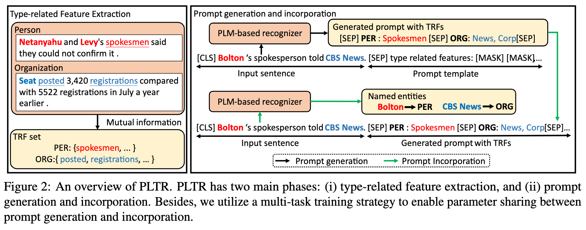
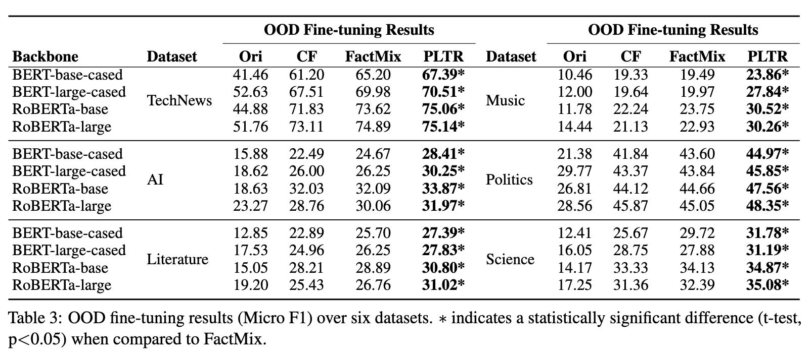

# PLTR
This repo is a PyTorch implementation of "[Generalizing Few-Shot Named Entity Recognizers to Unseen Domains with Type-Related Features](https://arxiv.org/abs/2310.09846)" (EMNLP 2023).

## Introduction
Recent few-shot cross-domain NER methods confront two challenges:
1. First, augmentation is limited to the training data, resulting in minimal overlap between the generated data and OOD examples.
2. Second, knowledge transfer is implicit and insufficient, severely hindering model generalizability and the integration of knowledge from the source domain.


In this paper, we propose a framework, prompt learning with type-related features (PLTR), to address these challenges. To identify useful knowledge in the source domain and enhance knowledge transfer, PLTR automatically extracts entity type-related features (TRFs) based on mutual information criteria. To bridge the gap between training and OOD data, PLTR generates a unique prompt for each unseen example by selecting relevant TRFs.

<div align=center>

</div>

## Main results
We evaluate PLTR's performance on the [CrossNER](https://arxiv.org/pdf/2012.04373.pdf) dataset for few-shot cross-domain NER.
<div align=center>

</div>

## Get stated
1. **Data augmentation**
   
   You can use the following command to augment data:
   
   ```python
   python main.py
   ```
   
2. **Train and evaluate the model**

	You can use the following command to train and evaluate PLTR:
   
   ```python
   python run.py
   ```

## Reference
```
@inproceedings{wang2023Iterative,
  author    = {Zihan Wang, Ziqi Zhao, Zhumin Chen, Pengjie Ren, Maarten de Rijke, and Zhaochun Ren},
  title     = {Generalizing Few-Shot Named Entity Recognizers to Unseen Domains with Type-Related Features},
  booktitle = {{EMNLP} '23: The 2023 Conference on Empirical Methods in Natural Language Processing, December 6-10, Resorts World Convention Centre, Singapore},
  year      = {2023}
}
```
